<!-- ╔══════════════════════════════════════════════════════════════╗ -->
<!-- ║  github.com/VgavaBR123                                      ║ -->
<!-- ║  Profile README — v3.0                                      ║ -->
<!-- ║  3 custom animated SVGs · terminal aesthetic · 2026          ║ -->
<!-- ╚══════════════════════════════════════════════════════════════╝ -->

<div align="center">

<!-- ▸▸▸ ANIMATED SVG HEADER ▸▸▸ -->
<a href="https://github.com/VgavaBR123">
  
</a>

</div>

<!-- ▸▸▸ ABOUT — terminal style ▸▸▸ -->

```
╭──────────────────────────────────────────────────────────────────────────────╮
│                                                                              │
│  ~/vgava ❯ whoami                                                            │
│                                                                              │
│  Engenheiro Mecatrônico de formação.                                         │
│  Pós-graduando em Ciência de Dados.                                          │
│  Diretor do Departamento de Tecnologia (DTI)                                 │
│  Secretaria Municipal de Economia — Porto Velho, RO.                         │
│                                                                              │
│  Construo pipelines de dados fiscais, malhas automatizadas de                │
│  conformidade tributária por CNPJ e agentes de IA para o setor público.      │
│                                                                              │
│  ~/vgava ❯ cat side_quests.txt                                               │
│                                                                              │
│  🖨️ Smart Print — ecossistema de impressão 3D                                │
│  🧩 Model Context Protocol — LLMs conectados a ferramentas locais           │
│  🎨 UI/UX · Figma · GSAP — porque engenheiro também faz design              │
│                                                                              │
│  ~/vgava ❯ echo $PHILOSOPHY                                                  │
│  "Dados bem orquestrados são decisões públicas mais inteligentes."           │
│                                                                              │
╰──────────────────────────────────────────────────────────────────────────────╯
```

<!-- ▸▸▸ DIVIDER ▸▸▸ -->
<div align="center">
  
</div>

<!-- ═══════════════════════════ STACK ═══════════════════════════ -->

<h2 align="center">
  
  &nbsp;STACK&nbsp;
  
</h2>

<div align="center">
<table>
<tr>
<td align="center" width="225">

**`// linguagens`**
<br/><br/>
<a href="#">
  
</a>
<br/>
<sub>Python · JavaScript · TypeScript · C++ · Dart</sub>

</td>
<td align="center" width="225">

**`// data & infra`**
<br/><br/>
<a href="#">
  
</a>
<br/>
<sub>PostgreSQL · MySQL · MongoDB · Docker · Supabase · Linux</sub>

</td>
<td align="center" width="225">

**`// front & design`**
<br/><br/>
<a href="#">
  
</a>
<br/>
<sub>React · Next.js · Flutter · Figma</sub>

</td>
<td align="center" width="225">

**`// ai & backend`**
<br/><br/>
<a href="#">
  
</a>
<br/>
<sub>FastAPI · Node.js · Firebase · Cloudflare · Obsidian</sub>

</td>
</tr>
<tr>
<td align="center" colspan="4">

**`// iot · automação · embarcados`**
<br/><br/>
<a href="#">
  
  
  
  
  
</a>
<br/>
<sub>Arduino · ESP32 · ThingsBoard · n8n · CLPs · Modbus · MQTT</sub>

</td>
</tr>
</table>
</div>

<br/>

<details>
<summary>&nbsp;⟐&nbsp;&nbsp;<b>Shields detalhados</b>&nbsp;&nbsp;(clique para expandir)</summary>
<br/>
<div align="center">


</div>
</details>

<!-- ▸▸▸ DIVIDER ▸▸▸ -->
<div align="center">
  
</div>

<!-- ═══════════════════════════ NOW ═══════════════════════════ -->

<h2 align="center">
  
  &nbsp;NOW&nbsp;
  
</h2>

```python
class ViniciusGava:
    """O que está rodando agora."""

    role     = "Diretor DTI @ SEMEC — Porto Velho, RO"
    intern   = "Estagiário @ PROTEC Automação Industrial — desde Jan/2025"
    edu      = ["Eng. Mecatrônica (FIMCA)", "Pós-grad. Ciência de Dados (UTFPR)"]
    company  = "Smart Print — Ecossistema de Impressão 3D"
    portfolio = "https://portfolio-tan-ten-22.vercel.app/"  # com @PedroAntonio

    projects = {
        "malha_fiscal": {
            "desc": "Pipeline automatizado de conformidade tributária",
            "tech": ["Python", "PostgreSQL", "NFS-e × PGDAS"],
            "status": "🟢 produção",
        },
        "bot_semec": {
            "desc": "Agente de IA com RAG para atendimento ao cidadão",
            "tech": ["pgvector", "FastAPI", "LLM"],
            "status": "🔵 desenvolvimento",
        },
        "geo_pipeline": {
            "desc": "Replicação cadastral via FDW/dblink → Docker",
            "tech": ["Docker", "PostgreSQL 16", "PowerShell"],
            "status": "🟢 produção",
        },
        "mcp_bridge": {
            "desc": "LLM bridge server com Model Context Protocol",
            "tech": ["FastAPI", "OpenRouter", "Cloudflare Tunnel"],
            "status": "🟡 experimental",
        },
        "thingsboard_iot": {
            "desc": "Sistema de monitoramento IoT open-source (PROTEC)",
            "tech": ["ThingsBoard", "ESP32", "Python", "MQTT"],
            "status": "🟢 produção · -40% tempo de diagnóstico",
        },
        "smart_city_lixo": {
            "desc": "Gestão de resíduos urbanos com sensores conectados",
            "tech": ["ESP32", "Sensores", "IoT", "Smart City"],
            "status": "🟢 entregue · 2024",
        },
        "esp32_rs485": {
            "desc": "Controle remoto industrial ESP32 + RS485 + React",
            "tech": ["ESP32", "RS485", "React", "Node.js"],
            "status": "🟢 produção",
        },
    }

    def __repr__(self):
        return "building the future of public sector tech 🚀"
```

<!-- ▸▸▸ DIVIDER ▸▸▸ -->
<div align="center">
  
</div>

<!-- ═══════════════════════════ JOURNEY ═══════════════════════════ -->

<h2 align="center">
  
  &nbsp;JOURNEY&nbsp;
  
</h2>

```
┌─ FORMAÇÃO ─────────────────────────────────────────────────────────────────┐
│                                                                            │
│  ▸  2025 — hoje    Especialização em Ciência de Dados        · UTFPR       │
│  ▸  2019 — 2024    Bacharelado em Engenharia Mecatrônica     · FIMCA       │
│  ▸  2017 — 2018    Técnico em Informática para Internet      · IFRO        │
│                                                                            │
└────────────────────────────────────────────────────────────────────────────┘

┌─ EXPERIÊNCIA ──────────────────────────────────────────────────────────────┐
│                                                                            │
│  ▸  hoje           Diretor DTI · SEMEC — Porto Velho/RO                    │
│                    pipelines fiscais · agentes de IA · governo digital     │
│                                                                            │
│  ▸  jan/2025 →     Estagiário · PROTEC Automação Industrial                │
│                    3 projetos CLP+IoT · -40% tempo de diagnóstico          │
│                    Python · C++ · ESP32 · sensores industriais             │
│                                                                            │
│  ▸  fev — ago/23   Auxiliar Administrativo                                 │
│                    automação de relatórios · planilhas inteligentes        │
│                                                                            │
└────────────────────────────────────────────────────────────────────────────┘

┌─ IDIOMAS & CERTIFICAÇÕES ──────────────────────────────────────────────────┐
│                                                                            │
│  🇧🇷 Português  ████████████████████  nativo                                │
│  🇺🇸 Inglês     ██████████████░░░░░░  B2 · leitura & conversação            │
│                                                                            │
└────────────────────────────────────────────────────────────────────────────┘
```

<!-- ▸▸▸ DIVIDER ▸▸▸ -->
<div align="center">
  
</div>

<!-- ═══════════════════════════ PORTFOLIO ═══════════════════════════ -->

<h2 align="center">
  
  &nbsp;PORTFOLIO&nbsp;
  
</h2>

<div align="center">

<a href="https://portfolio-tan-ten-22.vercel.app/">
  
</a>

<br/><br/>

<sub><b>VINICIUS &amp; PEDRO</b> — portfólio combinado com <a href="https://www.linkedin.com/in/pedro-ant%C3%B4nio-142167248">Pedro Antônio</a><br/>
front-end hero × back-end hero · engenharia mecatrônica · IoT · automação</sub>

</div>

<!-- ▸▸▸ DIVIDER ▸▸▸ -->
<div align="center">
  
</div>

<!-- ═══════════════════════════ METRICS ═══════════════════════════ -->

<h2 align="center">
  
  &nbsp;METRICS&nbsp;
  
</h2>

<div align="center">

<!-- Stats + Top Langs side by side -->

<!-- Activity Graph -->
<div align="center">
<a href="https://github.com/VgavaBR123">
  
</a>
</div>

</div>

<!-- ▸▸▸ DIVIDER ▸▸▸ -->
<div align="center">
  
</div>

<!-- ═══════════════════════════ SNAKE ═══════════════════════════ -->

<div align="center">
  
  <picture>
    <source media="(prefers-color-scheme: dark)" srcset="https://raw.githubusercontent.com/VgavaBR123/VgavaBR123/output/github-snake-dark.svg?v=1" />
    <source media="(prefers-color-scheme: light)" srcset="https://raw.githubusercontent.com/VgavaBR123/VgavaBR123/output/github-snake.svg?v=1" />
    
  </picture>

</div>

<!-- ▸▸▸ DIVIDER ▸▸▸ -->
<div align="center">
  
</div>

<!-- ═══════════════════════════ CONNECT ═══════════════════════════ -->

<h2 align="center">
  
  &nbsp;CONNECT&nbsp;
  
</h2>

<div align="center">

<a href="https://www.linkedin.com/in/vinicius-gava-87b734353/">
  
</a>
&nbsp;&nbsp;
<a href="mailto:gavadeoliveira@outlook.com">
  
</a>
&nbsp;&nbsp;
<a href="https://github.com/VgavaBR123">
  
</a>
&nbsp;&nbsp;
<a href="https://portfolio-tan-ten-22.vercel.app/">
  
</a>
&nbsp;&nbsp;
<a href="https://wa.me/5569993706233">
  
</a>

</div>

<!-- ═══════════════════════════ FOOTER ═══════════════════════════ -->

<br/>

<div align="center">

```
 ╭──────────────────────────────────────────────────────────────────╮
 │                                                                  │
 │  ⚡ "A tecnologia no setor público não deveria ser diferencial   │
 │      — deveria ser o padrão."                                    │
 │                                                                  │
 │  📍 Porto Velho, Rondônia, Brasil                                │
 │  🖨️ Smart Print — impressão 3D                                   │
 │  🏛️ SEMEC — dados fiscais + IA                                   │
 │                                                                  │
 ╰──────────────────────────────────────────────────────────────────╯
```

<br/>

<!-- ▸▸▸ ANIMATED SVG FOOTER ▸▸▸ -->


<br/>

<!-- visitor counter — stealth mode -->


</div>
